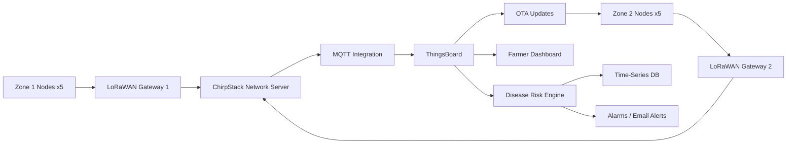

# Crop Disease Early Warning Network - ThingsBoard Edition

## 1. Title Page

Student name:

Student ID:

Course: IoT Applications Development - SWAPD 453

Semester: Spring 2026

Date:

## 2. System Architecture

The system contains 10 simulated LoRaWAN sensor nodes split across two field zones. Each zone has five nodes and one gateway. ChirpStack receives LoRaWAN uplinks and forwards application data over MQTT. ThingsBoard receives the telemetry through an MQTT Integration, stores the values in the built-in time-series database, evaluates disease risk in the Rule Engine, displays live data on dashboards, sends alerts, and manages OTA firmware updates.

Data flow:



Insert architecture screenshot/diagram here.

## 3. LoRaWAN Simulation

The simulator creates reproducible telemetry using a fixed random seed. The data pattern starts with normal environmental readings, gradually increases humidity to simulate pre-disease conditions, then creates high humidity and rainfall windows that trigger HIGH and CRITICAL risk.

Telemetry keys:

- `temperature`
- `humidity`
- `leaf_wetness`
- `rainfall`

Insert screenshots:

- ChirpStack Applications page.
- ChirpStack registered devices.
- ChirpStack gateways.
- Live LoRaWAN frames.

## 4. ThingsBoard Setup

ThingsBoard CE was deployed locally using Docker with PostgreSQL. Ten devices were created and assigned to two device profiles:

- `Zone1_Sensor`: `zone1_node_1` to `zone1_node_5`
- `Zone2_Sensor`: `zone2_node_1` to `zone2_node_5`

The MQTT Integration subscribes to:

```text
application/+/device/+/event/up
```

Include the uplink converter code from `thingsboard/uplink_data_converter.js`.

Insert screenshots:

- Device list.
- Device profiles.
- Customers if bonus is implemented.
- MQTT Integration.
- Data converter.

## 5. Disease Risk Engine

The Rule Chain computes `risk_level` from incoming telemetry:

- LOW: humidity below 70%, or temperature below 15 C, or temperature above 35 C.
- MODERATE: humidity 70-85% and temperature 15-25 C.
- HIGH: humidity above 85% and temperature 18-25 C.
- CRITICAL: HIGH conditions plus leaf wetness above 8 hours and rainfall above 5 mm.

Script node used:

Paste `thingsboard/risk_engine_script.js` here.

Sample trigger values:

| Risk | Temperature | Humidity | Leaf Wetness | Rainfall |
| --- | ---: | ---: | ---: | ---: |
| LOW | 36 | 60 | 2 | 0 |
| MODERATE | 22 | 78 | 4 | 0 |
| HIGH | 22 | 90 | 7 | 0 |
| CRITICAL | 22 | 92 | 9 | 8 |

Insert screenshots:

- Rule Chain graph.
- Debug events.
- Time-series values.
- Alarm/alert for HIGH or CRITICAL.

## 6. Dashboard

The dashboard contains:

- Current risk level per zone.
- Historical temperature and humidity chart.
- Recent rainfall bar chart.
- Alert history alarm widget.

Insert dashboard screenshots here.

## 7. OTA Update Workflow

After two weeks of operation, Zone 2 threshold values were updated for grape-specific disease conditions. A firmware package was created in ThingsBoard:

- Title: `thresholds_v2`
- Version: `1.1.0`
- Target profile: `Zone2_Sensor`
- Payload: `thresholds_v2_config.json`

Only Zone 2 devices receive this update because the firmware package is assigned to the `Zone2_Sensor` device profile.

Device-side OTA state transitions:

```text
DOWNLOADING -> DOWNLOADED -> VERIFIED -> UPDATING -> UPDATED
```

Rollback scenario:

If two or more Zone 2 devices report `fw_state = FAILED` for version `1.1.0`, the rollback branch triggers a REST API call to reassign the previous firmware package to the `Zone2_Sensor` profile and creates a CRITICAL rollback alarm.

Insert screenshots:

- OTA package creation.
- Device Profile firmware assignment.
- `fw_state` telemetry.
- Rule Chain debug output.
- Rollback alarm.

## 8. Security Implementation

The system uses per-device credentials so one device cannot publish telemetry as another device. For the bonus implementation, X.509 certificates and MQTTS can be enabled so each node authenticates with a unique certificate over TLS.

Implemented security checks:

- Unique access token or certificate per device.
- TLS/MQTTS recommended on port 8883.
- Customer separation for Zone 1 and Zone 2.
- Audit logs.
- Device Profile alarm rules:
  - No telemetry for more than 30 minutes.
  - Telemetry rate above twice the expected baseline.
  - Physically impossible values.

Attack simulation:

A rogue client attempts to connect using an invalid token and publish false CRITICAL telemetry. ThingsBoard rejects the connection, preventing false alerts.

Insert screenshots:

- Credential setup.
- Attack script rejection output.
- ThingsBoard logs/audit.
- Security alarm rules.

## 9. Challenges and Lessons Learned

Main challenges:

- Mapping LoRaWAN-style uplinks into ThingsBoard telemetry format.
- Designing a deterministic simulator that can demonstrate all risk levels during a short demo.
- Keeping OTA targeting limited to Zone 2 by using Device Profiles.
- Creating rollback logic that reacts to repeated firmware failures.

Lessons learned:

- Device Profiles are useful for grouping devices, OTA targeting, and shared alarm rules.
- Seeded simulation is important because it makes demos repeatable.
- Rule Chain debug mode is essential for verifying telemetry transformation and alert logic.
- Per-device authentication is required to prevent false telemetry injection.
